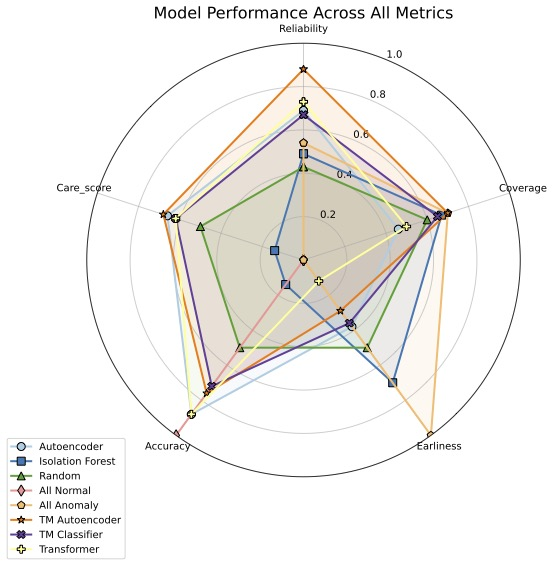

# Anomaly Detection in Wind Turbine SCADA Data Using Tsetlin Machine Autoencoder and Classifier

Welcome to the repository for our 2025 master thesis "Anomaly Detection in Wind Turbine SCADA Data Using Tsetlin Machine
Autoencoder and Classifier". This repository contains the code and resources used to implement the Tsetlin Machine
Autoencoder and Classifier for detecting anomalies in wind turbine SCADA data.

The experiments were conducted using the Tsetlin Machine framework, which is a novel machine learning approach based on
propositional logic and automata theory. The Tsetlin Machine Autoencoder is used for unsupervised anomaly detection,
while the Tsetlin Machine Classifier is employed for supervised classification tasks.

All models are trained using the dataset proposed by the excellent paper **CARE to Compare: A real-world dataset for
anomaly
detection in wind turbine data**. [The dataset (v1) are available here.](https://zenodo.org/records/10958775)

Models are evaluated using the CARE metric framework proposed by the same
paper. [Read the paper here](https://paperswithcode.com/paper/care-to-compare-a-real-world-dataset-for)

## Results

